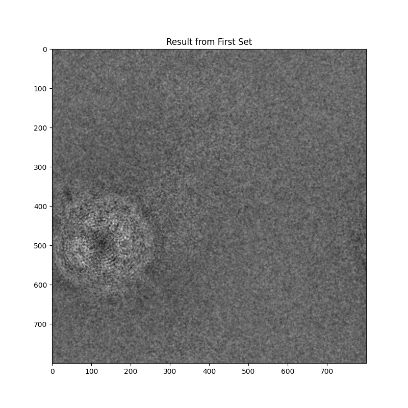

# Cryo-EM Image Processing Project
By Brady Gin

## Introduction
This project focused on reconstructing the underlying structure of a macromolecule from 500 noisy projection images obtained through cryo-electron microscopy (cryo-EM). The dataset presented many challenges including noise corruptions, potential point-spread function (PSF) distortions, and in-plane orientations and translations of the macromolecule between images.

## Methodology

### 1. Dataset Organization and Processing Strategy
The 500 images were partitioned into two sets of 250 images each. This partitioning allowed for verification that the processing produced good results across the different subsets and enabled a final averaging step to improve the signal-to-noise ratio.

### 2. Image Alignment and Averaging
The main bulk of the reconstruction process used iterative alignment and averaging. Image 100 was chosen as the initial reference because it had a clear representation of the structure for the algorithm to go off of.

#### Cross-Correlation Based Alignment
Cross-correlation was implemented using Fast Fourier Transform (FFT) for efficiency:
```python
def cross_correlate(self, img1, img2):
    """
    Compute cross-correlation using FFT
    """
    # Compute FFTs
    fft1 = fft.fft2(img1)
    fft2 = fft.fft2(img2)
    
    # Compute cross-correlation
    correlation = fft.ifft2(fft1 * np.conj(fft2))
    correlation = fft.fftshift(correlation)
    
    return np.abs(correlation)
```
This quickly figured out the spatial correlation in the frequency domain, gave a good measure of how similar the images are, and gave an accurate determination of the translational offsets.

#### Translation Detection and Correction
Optimal shifts were determined by finding the peak in the cross-correlation map:
```python
def find_shift(self, img):
    """
    Find optimal x,y shifts using cross-correlation
    """
    correlation = self.cross_correlate(self.current_average, img)
    
    # Find peak correlation position
    y, x = np.unravel_index(np.argmax(correlation), correlation.shape)
    
    # Convert to shifts
    center_y, center_x = correlation.shape[0]//2, correlation.shape[1]//2
    shift_y = y - center_y
    shift_x = x - center_x
    
    # Get correlation value at peak
    max_correlation = np.max(correlation)
    
    return shift_x, shift_y, max_correlation
```

#### Progressive Averaging
A weighted running average was used to build up the reconstructed image:
```python
def update_average(self, new_img, img_count):
    """Update running weighted average"""
    self.current_average = (img_count / (img_count + 1)) * self.current_average + 
                          (1 / (img_count + 1)) * new_img
```
This approach gives the appropriate weight to each image and gradually improves each one with every iteration.

#### Correlation Thresholding
A correlation threshold of 0.8 was used to accept or reject images. This helped make sure only well-aligned images contributed to the final reconstruction.
```python
# If correlation is good enough, update average
if correlation > correlation_threshold:
    self.update_average(aligned_img, len(self.aligned_images))
    self.aligned_images.append(aligned_img)
```

## Results

### 1. Individual Set Processing



The processing of each 250-image set produced consistent results, showing a clear ring structure and similar noise characteristics.

### 2. Progress
[Short video of how the algorithm made progress](cryoFMvideo.mp4)

### 3. Final Combined Result


The final combination of both sets merged these two together and gave us a final reconstruction of the structure.

## Technical Challenges and Solutions

1. **Noise Handling**: My first attempts at averaging produced very blurred results which i believe were due to the high-frequency noise dominating the alignment process. I also tried some Gaussian filtering which ended up being too aggressive and was eliminating structural details along with noise. The final solution of correlation-based averaging naturally reduced some of the noise while preserving the high-frequency structural information, as consistent features reinforced each other while random noise canceled out across multiple images.

2. **Alignment Accuracy**: My early tests trying to use a simple intensity-based alignment failed due to the noise levels overwhelming the signal. I also tried directly maximizing the pixel-wise correlation but it took an extremely long time and was sensitive to seemingly random spots in the images. The FFT-based approach solved both issues and provided good global alignment in frequency space while significantly reducing computation time for each image comparison.

3. **PSF Variations**: Initial attempts to deconvolve each image introduced ringing artifacts and more noise. I tried estimating a global PSF but it was unreliable due to how different the images were. The strategy of averaging multiple aligned images naturally compensated for these PSF variations, as the true structure would consistently reinforce itself while the PSF artifacts varied and diminished in the average.

## Key Decisions and Rationale

1. **Dataset Partitioning**: Early experiments with processing all 500 images together showed weird inconsistencies in the convergence and made it hard to confirm my results. Splitting the dataset revealed that each half converged to similar structures so I knew my reconstruction was reliable. Processing separate sets also exposed some alignment bias, as images tended to align better within their set than across each set.

2. **Correlation Threshold**: Initial testing with a threshold of 0.6 accepted too many poorly aligned images, while 0.9 rejected too many good alignments. Analysis of the correlation value distribution showed a natural separation point around 0.8, where well-aligned images consistently scored above this threshold while misaligned or highly corrupted images fell below it.

## Conclusion
The implemented approach successfully reconstructed the macromolecule structure from the noisy cryo-EM data. The key strengths of the method were robust alignment through FFT-based cross-correlation, effective noise reduction through averaging, quality control through correlation thresholding, and validation through consistent results across dataset partitions. The final reconstruction shows clear structural details while maintaining a good signal-to-noise ratio, demonstrating the effectiveness of these methods.
